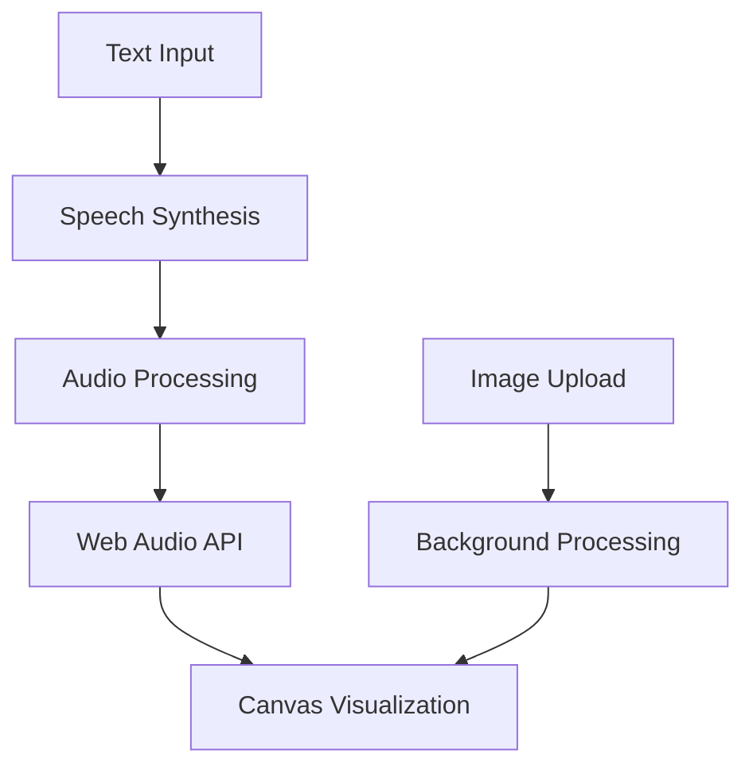

# 🎙️ Text-to-Voice Generator


> Transform text into natural speech with stunning real-time audio visualizations! 🎵


## ✨ Features

### 🗣️ Advanced Text-to-Speech

- **Natural Voice Synthesis**: Convert text to lifelike speech
- **Voice Customization**: Choose from multiple voice profiles
- **Speed Control**: Adjust playback speed (0.75x to 1.5x)
- **Playback Controls**: Intuitive play/pause/stop functionality

### 📊 Dynamic Audio Visualization

- **Real-time Waveforms**: See your audio come to life
- **Responsive Design**: Full-width visualization bars
- **Smooth Animation**: Fluid transitions and effects
- **Minimalist Style**: Clean white bars on any background

### 🖼️ Background Customization

- **Custom Uploads**: Personalize with your own images
- **Drag & Drop**: Easy image uploading
- **Preview Mode**: See changes before applying
- **Smart Scaling**: Automatic image optimization

### 💫 Modern User Interface

- **Dark Theme**: Easy on the eyes
- **Responsive Layout**: Works on all devices
- **Intuitive Design**: User-friendly controls
- **Seamless Experience**: Clean and modern aesthetics

## 🛠️ Built With

- **HTML5** - Structure and semantics
- **CSS3** - Styling and animations
- **JavaScript** - Core functionality
- **Web Speech API** - Text-to-speech conversion
- **Canvas API** - Audio visualization

## 🚀 Quick Start

1. **Clone the repository**
   ```bash
   git clone https://github.com/Zakvs/Text-to-Voice-Generator.git
   ```

2. **Navigate to project directory**
   ```bash
   cd Text-to-Voice-Generator
   ```

3. **Visit `http://localhost:8000` in your browser or open file `index.html` with live server**

## 💡 Usage

1. 📝 Enter your text in the input area
2. 🖼️ (Optional) Upload a background image
3. 🎤 Select voice and speed preferences
4. ▶️ Click "Generate" to start
5. 🎵 Watch and listen as your text comes alive!

## 🔧 Technical Architecture



## 🎯 Upcoming Features

- [ ] Additional visualization patterns
- [ ] Extended voice library
- [ ] Audio recording & export
- [ ] Social sharing capabilities
- [ ] Custom theme builder
- [ ] Background music mixer

## 🤝 Contributing

Contributions are always welcome! See [CONTRIBUTING.md](CONTRIBUTING.md) for ways to get started.

1. Fork the Project
2. Create your Feature Branch (`git checkout -b feature/AmazingFeature`)
3. Commit your Changes (`git commit -m 'Add some AmazingFeature'`)
4. Push to the Branch (`git push origin feature/AmazingFeature`)
5. Open a Pull Request


## 📬 Contact

Dimas Nurzaky -  dndimas77@gmailcom


---

⭐️ If you like this project, give it a star!
